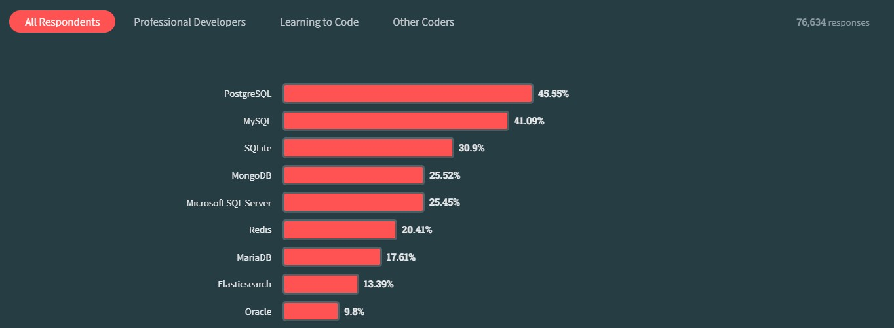

# PostgreSQL

```text
우리 프로젝트의 데이터베이스는 postgreSQL로 결정했어.
```

## 채택하게 된 과정

> 데이터베이스 아무거나 써도 되는 상황인데, 스택오버플로우의 랭킹을 참고해서 안써본 데이터베이스를 써보자!



출처 [스택오버플로우 2023 통계자료 https://survey.stackoverflow.co/2023](https://survey.stackoverflow.co/2023/)

## PostgreSQL이란 무엇인가?


```text
이거 민서가 한번 알아보라한 코끼리 잖아?
```

### GPT의 답변

```text
PostgreSQL은 객체-관계형 데이터베이스 관리 시스템(ORDBMS)의 하나입니다.
객체-관계형 데이터베이스: 관계형 데이터베이스 시스템의 기본 기능에 객체 지향 프로그래밍 언어의 기능을 추가하여 더 다양한 데이터 모델을 지원합니다.

1. 오픈 소스: 무료로 사용 가능

2. 기능 확장성: 사용자 정의 데이터 형식, 함수, 인덱스, 집계 함수 등을 만들어서 확장할 수 있습니다.

3. 풍부한 기능: 트랜잭션, 서브쿼리, 뷰, 트리거 등 다양한 기능을 지원합니다.

4. 높은 신뢰성: ACID(Atomicity, Consistency, Isolation, Durability) 트랜잭션을 지원하여 데이터의 일관성과 안정성을 보장합니다.

5. 다양한 플랫폼 지원: Windows, MacOS, Linux
```

> TMI가 좀 있어서 중요해 보이는 내용만 요약했다.

### IBM 공식 홈페이지

```text
PostgreSQL은 "Post-GRES"로 발음하며, 안정성, 유연성, 개방형 기술 표준 지원으로 알려져있는 오픈 소스 데이터베이스

안정적이며, 성숙한 관계형 데이터베이스 중 하나

버클리의 컴퓨터공학과 교수인 Michael Stonebreaker가 고안한 아이디어
1994년 SQL 지원을 추가하였고, PostgreSQL이 탄생하였다.
```

#### 왜 PostgreSQL을 사용하나?

- 무료이기 때문에 라이선스 제한에서 자유로움
- 데이터베이스 시스템의 한계를 이해하는 전문 개발자와 민간 기업은 PostgreSQL을 많이 지원함
  - 사용기업: (주)스푼라디오, 라프텔, (주)크몽, 직방, 카카오페이 등등
- 확장성, **동시성 지원**, 심층적인 언어 지원, 비즈니스 연속성, 오픈 소스

#### PostgreSQL의 동시성 지원 기술

- PostgreSQL은 MVCC(MultiVersion Concurrency Control)을 사용하여 동시성을 효율적으로 관리합니다.

#### MVCC MultiVersion Concurrency Control 이란?

- 기존의 데이터베이스 시스템은 읽기/쓰기 충돌 방지를 위해 레코드에 대한 액세스를 차단(블로킹 Blocking)
- MVCC는 읽기/쓰기시에 레코드에 대한 액세스를 차단하지 않음(Non-Blocking)

#### MVCC의 동시성 과정

- 각 트랜잭션이 데이터 읽기/쓰기 시에 데이터베이스의 **버전**을 보게 됨
- 트랜잭션이 읽기를 수행할 때, 쓰기를 동시에 데이터를 수정해도 **버전**이 다르기 때문에 영향이 없음
- 블로킹(Blocking)이 발생해야 될 상황에서는 블로킹(Blocking) 대신에 이전 버전의 데이터를 읽거나 블로킹(Blocking)을 발생시키지 않음

#### PostgreSQL의 기능

- 버전을 관리하기 때문에 **특정 시점 복구**가 가능하다!

```text
PostgreSQL 설치 및 데이터베이스 구축은 다음에...
```
