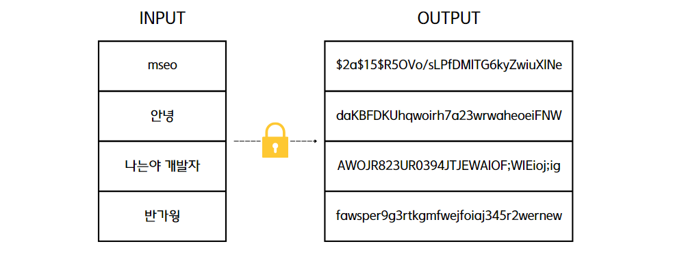
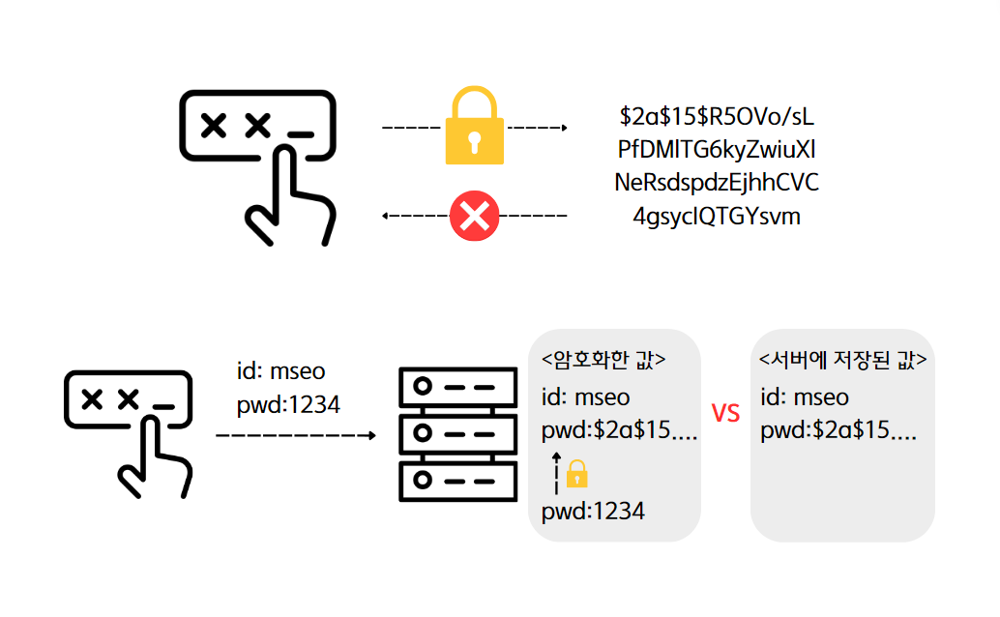
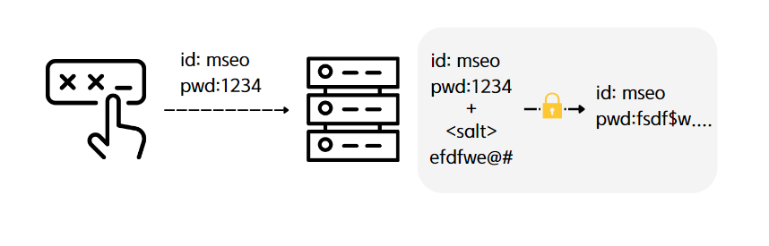
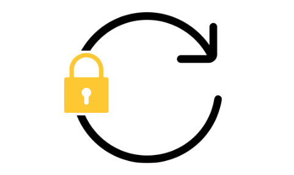
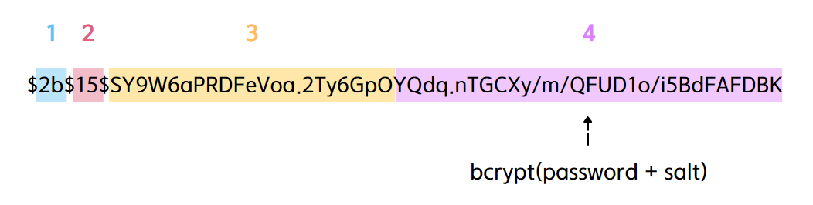
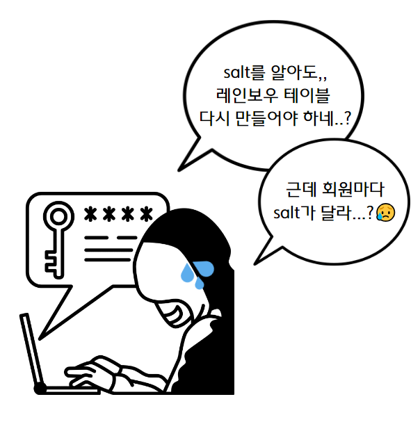
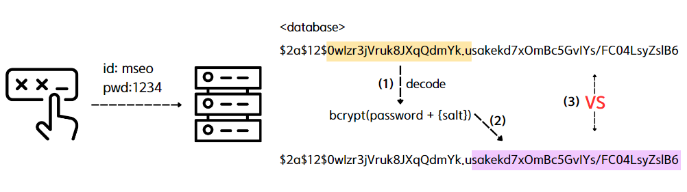

> 👩‍💻 프로젝트에서 어떤 암호화를 쓸 것인지 고민하다가 Bcrypt를 사용하도록 해 Bcrypt가 무엇인지에 대해 작성해보겠다!
#### 참고
* ISO-27001 보안 규정을 준수해야하는 상황이면 **PBKDF2**를 사용하자.
* 일반적으로 규정을 준수해야할 상황이 아니면 구현이 쉽고 비교적 강력한 **Bcrypt**를 사용하자.
* 보안 시스템을 구현하는데 많은 비용을 투자할 수 있다면, **Scrpyt**를 사용하자.

# Bcrypt
> 단방향 암호화를 위해 만들어진 해시 함수

## 🙋‍♀️ 오늘 공부할 것은?
* 단방향 암호화
* 단방향 암호화 한계
  * 솔팅
  * 키 스트레칭
* Bcrypt

## 해시 함수

  

1. 임의의 데이터를 고정된 길이(압축 함수)로 매핑하는 함수
2. 동일한 입력값에 대한 동일한 출력값
3. 입력값이 약간 변경되어도 다른 출력값

## 단방향 암호화

  

* 한쪽 방향으로 암호화를 한다는 것을 의미한다.
  * 즉, 암호화만 가능하고 복호화는 할 수 없다.
* 비밀번호를 단방향 암호화 방식으로 저장하는 경우 패스워드 DB가 유출되어도 안전하다.
* 패스워드를 검증할 때에는 사용자로부터 입력받은 비밀번호를 똑같은 방식으로 암호화하여 암호화된 패스워드끼리 비교한다.
* 그래서 비밀번호를 잊어버리면 찾기가 불가능해 새로운 비밀번호를 입력해야 한다.
  * 비밀번호 변경 메일
  * SMS인증

### 🤔 왜 양방향이 아닌 단방향을 선택했는지
> 양방향은 키를 사용하여 암호화 및 복호화를 할 수 있다.  즉, 키가 유출되지 않도록 관리해야 하기 때문에 유출될 걱정이 필요없는 단방향을 선택했다.

### 💡 궁금한점 - 복호화가 왜 불가능?
>수학적으로 불가능하다! 
대부분의 단방향 암호화 함수는 수학적으로 역함수를 찾기 어렵도록 설계되어 있다. 이는 주어진 암호문으로부터 원문을 복구하는 것이 매우 어렵다는 것을 의미! 

## 🔓 단방향 암호화의 한계

### 🌈 Rainbow Table
> 위에서 해시 함수는 동일한 입력값에는 동일한 출력값을 준다고 했다. 이를 이용해 해시 함수를 사용하여 변환 가능한 모든 해시 값을 저장시켜 놓은 표를 말한다.

#### 💡 그래서 사용하는 것이 🧂 salt

  

> 비밀번호에 임의의 문자열인 salt를 추가하여 출력값을 생성하기 때문에 비밀번호가 단순하더라도 레인보우 테이블에서 찾을 수 없다. 
*salt는 최소 128bit정도는 되어야 안전하다고 한다.

### 🧩 Brute Force 공격 (무차별 대입 공격)
> 해시 함수는 원래 빠른 데이터의 검색을 목적으로 만들어졌기 때문에 해커는 빠른 속도로 임의의 문자열의 출력값과 해킹할 대상의 출력값을 비교할 수 있다.

#### 💡 그래서 사용하는 것이 키 스트레칭

  

> 해싱을 여러 번 반복하여 시간을 늘림으로써 무차별 대입 공격에 대비하는 것이다.

## 🔒 Bcrypt
> Blowfish 암호를 기반으로 설계된 암호화 함수이며 현재까지 사용중인 가장 강력한 해시 메커니즘 중 하나

> 레인보우 테이블 공격을 방지하기 위해 솔팅과 키 스트레칭을 적용한 대표적인 예
* 내부적으로 랜덤 한 🧂 salt를 생성하기 때문에 같은 문자열에 대해서 매번 다른 해싱 결과를 반환
  * 🌈레인보우 테이블 공격 방지
  * 또한, 해시 값 내부에 salt 값이 포함되기 때문에 salt 값을 따로 저장하지 않아도 됨
  * 해싱 결과로 반환되는 String의 길이는 매번 60으로 동일
* 반복 횟수를 늘려서 연산 속도를 늦출 수 있다
  * 🧩 Brute Force 공격 방지

### Bcrypt 구조

1. 해시 알고리즘을 나타낸다 2b는 bcrypt를 나타낸다
2. 키 스트레칭으로 반복 횟수를 나타낸다(2^15)
3. 16바이트(128비트) salt, 22자로 인코딩된 base64
4. 24바이트(192비트) 해시, 31자로 인코딩된 base64

#### 💡 그럼 salt값을 알 수 있는거 아닌가? 무슨 소용이지..?

  

> 그렇다,, salt를 알아도 해당 salt와 결합하여 임의의 문자열을 무차별 대입을 해보아야 하기 때문에 공격하는 사람 입장에서는 곤란하ㄷ ㅏ,,

> 즉, salt의 레인보우 테이블 새로 생성하여 만들기 위해서는 엄청나게 큰 데이터를 필요로 하기 때문에 자연스럽게 레인보우 테이블 생성을 방지하는 것이다

> 또한 Bcrypt는 회원마다 다른 salt를 만들기 때문에 더 부담이 되는 것

#### 💡 salt가 매번 달라지는데 어떻게 매칭하는걸까?

> 위에서 말했듯이 salt는 22자로 인코딩된 base64라고 했다. 따라서 데이터베이스에서 해당 회원의 값을 가져와 salt부분을 디코딩하고 사용자로부터 얻은 값을 이용해 Bcrypt 암호화하여 데이터베이스에 있는 값과 비교하는 것이다

### 참고자료
* [암호화 종류](https://inpa.tistory.com/entry/NODE-%F0%9F%93%9A-bcrypt-%EB%AA%A8%EB%93%88-%EC%9B%90%EB%A6%AC-%EC%82%AC%EC%9A%A9%EB%B2%95#bcrypt)
* [해시함수](https://medium.com/curg/%EC%95%94%ED%98%B8%ED%95%99-chf-cryptographic-hash-function-%EC%95%94%ED%98%B8%ED%99%94-%ED%95%B4%EC%8B%9C-%ED%95%A8%EC%88%98-%EB%A9%94%EC%BB%A4%EB%8B%88%EC%A6%98-8e157ff89296)
* [단방향 암호화](https://hyunseo-fullstackdiary.tistory.com/127)
* [Bcrypt 구조](https://velog.io/@yenicall/%EC%95%94%ED%98%B8%ED%99%94%EC%9D%98-%EC%A2%85%EB%A5%98%EC%99%80-Bcrypt)
* [Bcrypt 개념](https://wildeveloperetrain.tistory.com/175)
* [salt](https://st-lab.tistory.com/100)
* [salt match](https://codingdog.tistory.com/entry/bcrypt%EB%8A%94-salt%EA%B0%80-%EB%A7%A4%EB%B2%88-%EB%8B%AC%EB%9D%BC%EC%A7%80%EB%8A%94%EB%8D%B0-match%EB%A5%BC-%EC%96%B4%EB%96%BB%EA%B2%8C-%EC%9E%98-%EC%8B%9C%ED%82%AC%EA%B9%8C%EC%9A%94)

ps.. 글쓴이의 자료 만드는 실력이 늘고 있다,,그래도 이해한걸 토대로 정리하는 거니,,좋다,,😢(우는거 아니라 땀,,)