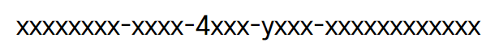
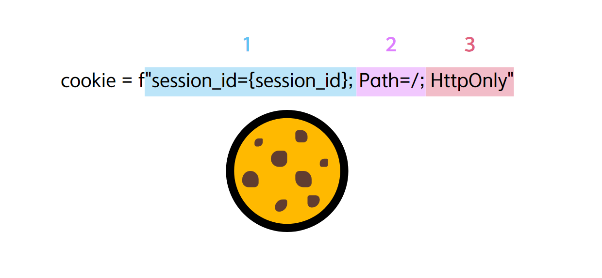
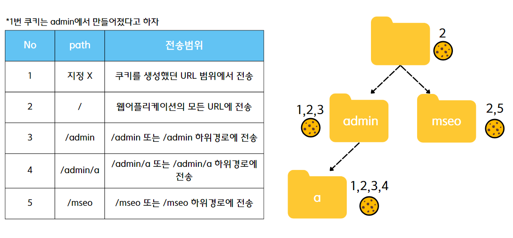

# 세션 적용하기

## 💻 코드

```python
from fastapi import FastAPI, HTTPException, Depends, status, Cookie
from typing import Optional
from uuid import uuid4

app = FastAPI()

# 세션 데이터를 저장할 딕셔너리(임시)
session_data = {}

# 세션 ID를 생성하는 함수
def generate_session_id():
    return str(uuid4())

# 세션을 생성하고 세션 ID를 클라이언트에게 전달하는 엔드포인트
@app.post("/login/")
async def login(username: str):
    session_id = generate_session_id()
    session_data[session_id] = {"username": username}
    
    # 쿠키로 세션 아이디를 전달
    response = {"session_id": session_id}
    
    # 쿠키에 HttpOnly 속성을 추가하여 JavaScript에서 접근할 수 없게 만듦
    cookie = f"session_id={session_id}; Path=/; HttpOnly"
    
    return response, {"headers": {"Set-Cookie": cookie}}


# 클라이언트의 요청에 따라 세션 ID를 사용하여 세션 데이터를 반환하는 엔드포인트
@app.get("/user/")
async def get_user(session_id: Optional[str] = Cookie(None)):
    if session_id is None or session_id not in session_data:
        raise HTTPException(status_code=status.HTTP_401_UNAUTHORIZED, detail="세션이 유효하지 않습니다.")
    return {"username": session_data[session_id]["username"]}
```

## 세션 ID 생성

### 🔎 uuid4가 뭐야?
>  UUID(Universally Unique Identifier)를 생성하기 위한 Python의 내장 모듈인 uuid 모듈에 있는 함수 중 하나다. UUID는 전 세계적으로 고유한 값을 생성하는 데 사용되는 표준 형식이다

> 주로 세션 식별자, 쿠키 값, 무작위 데이터베이스 키 등에 사용

#### 💡 일련의 번호를 사용해도 되지 않나...?
> uuid4는 무작위로 생성된 값이므로 예측하기 어려워 보안성을 강화할 수 있다

이외에도,,,
1. 고유성
2. 무작위성<br>: 완전히 무작위로 생성되므로 생성된 값에서 어떠한 정보도 추론할 수 없다
3. 이식성과 범용성<br>: 어떤 시스템이나 애플리케이션에서도 고유한 식별자로 사용될 수 있다

#### 💡 uuid4 어떻게 생겼을까..?
* x는 무작위로 생성된 16진수 숫자(0-9, a-f)로 채워진다
* y는 8, 9, a, b 중 하나의 값으로 설정



#### 💡 겹치지 않을까?
> 340,282,366,920,938,463,463,374,607,431,768,211,456개의 사용 가능한 UUID가 존재한다 별의 개수보다 더 많다고 하니.. 걱정은 안해도 되겠죠..?


## 쿠키 생성

### 🔎 Set-Cookie
> Cookie는 http header에 포함되어있으므로 설정해주면 된다


나는 위와 같이 쿠키를 설정해 줄 것이다!
1. 쿠키에 데이터 넣기 🍽
    * key: value 형식으로 이루어져 있다
    * 여러개를 넣고 싶다면 session_id={session_id}; name=username; 그냥 여러개 만들어주면 된다^^
2. 쿠키 전송범위 정하기💨

    

3. HttpOnly로 보안강화하기 🧐
   > HttpOnly는 웹 쿠키의 속성 중 하나로, 이 속성이 설정된 쿠키는 JavaScript를 통한 접근을 제한할 수 있다

   > 악의적인 스크립트가 웹 페이지의 쿠키를 탈취하여 사용자의 개인 정보를 유출하려는 시도를 방지할 수 있기 때문에 만약 쿠키에 중요한 세션 정보나 사용자 인증 정보 등이 포함되어 있다면, 이러한 정보가 JavaScript로 탈취되는 것을 방지한다

### 참고자료
* [uuid4란](https://yoonminlee.com/uuid-uniqueness-duplication)
* [쿠키 전송범위](https://dololak.tistory.com/546)