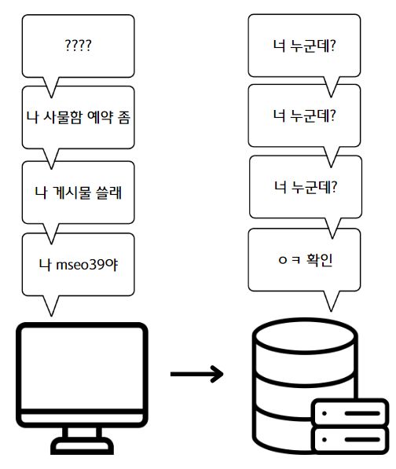
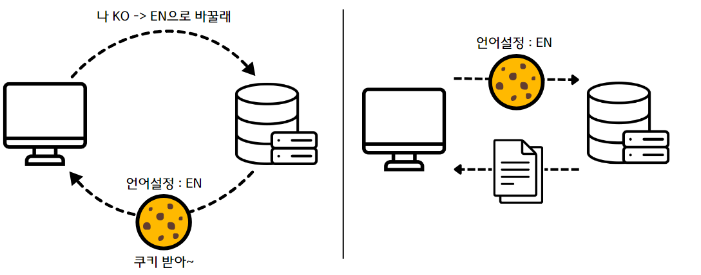
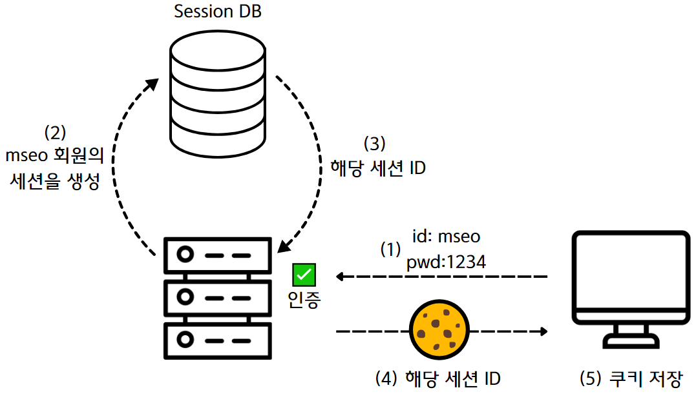
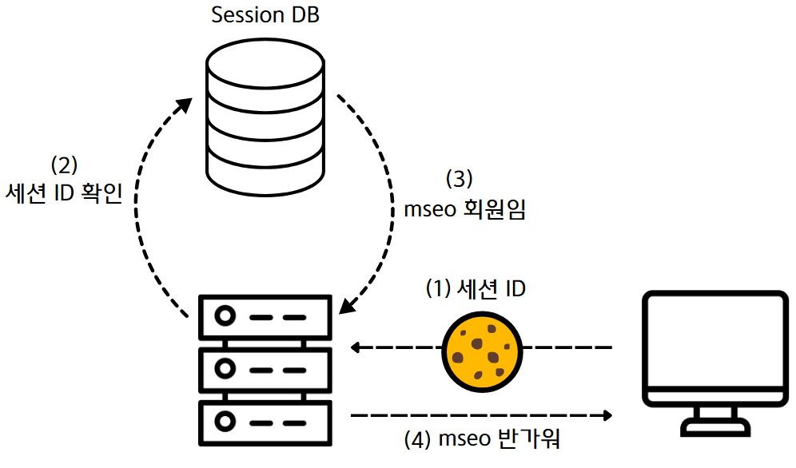
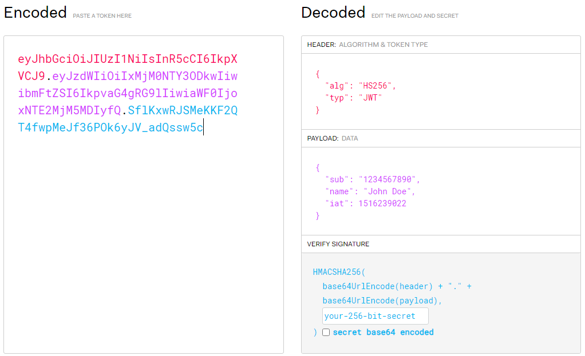
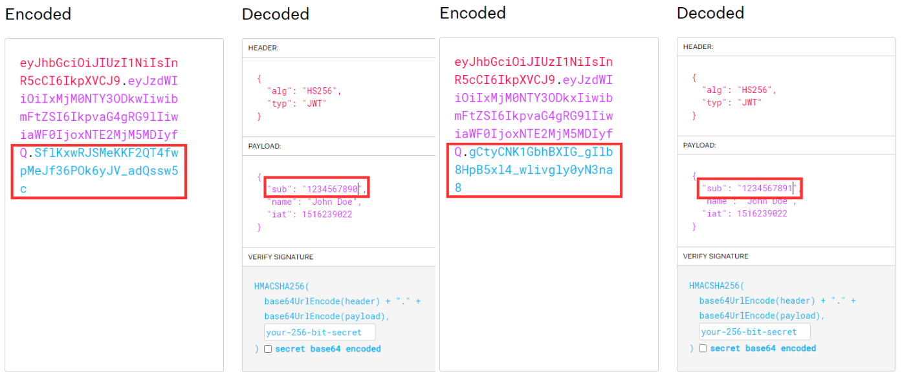
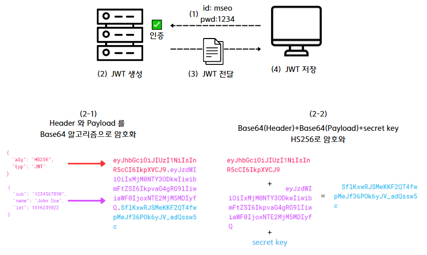
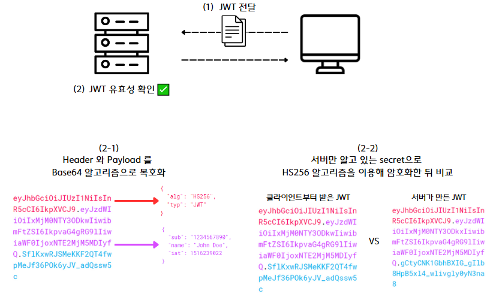

# 로그인

## 🙋‍♀️ 로그인과 관련된 개념은?
* 인증과 인가
* 쿠키
* 세션
* jwt

## 🔑 인증과 인가
* 인증 : 어떤 개체(사용자 또는 장치)의 신원을 확인하는 과정
* 인가 : 어떤 개체가 어떤 리소스에 접근할 수 있는지 또는 어떤 동작을 수행할 수 있는 지를 검증하는 것 즉, 접근 권한을 얻는 일

💡 그럼 다음 그림에서 내가 할 수 있는 것은?
> 해당 회사의 직원이 아니기 때문에 들어갈 수 는 없지만 서류를 제출할 수 는 있다! 이처럼 내가 누구인지 확인을 하는 것이 인증이고 내가 취준생이냐 직원이냐에 따라 할 수 있는 동작을 인가라고 한다.

> 더 구체적으로 게시물을 예로 설명해보면 인증은 로그인이고 인가는 해당 게시물을 수정할 수 있는 사람인지 확인하는 것이다.
<p align="center">
  
</p>

## 무상태 (Stateless)
> HTTP의 주요 특징이 바로 무상태이다. 무상태는 클라이언트와 서버 관계에서 서버가 클라이언트의 상태를 보존하지 않음을 의미한다.

💡 즉, 내가 어떤 동작을 할 때 마다 로그인을 해줘야 하는 불편함이 발생
<p align="center">
  
</p>


## 🍪 쿠키
> 쿠키는 무상태(Stateless)와 비연결성(Connectionless)이라는 인터넷 통신의 특성으로 서버가 기억하지 못하는 사용자의 정보를 알기 위해서 사용한다

> 쿠키는 웹 서버가 생성하여 웹 브라우저로 전송하는 작은 정보 파일이다. <br>웹 브라우저는 수신한 쿠키를 미리 정해진 기간 동안 또는 웹 사이트에서의 사용자 세션 기간 동안 저장한다. <br>웹 브라우저는 향후 사용자가 웹 서버에 요청할 때 관련 쿠키를 첨부한다.

* 쿠키는 도메인에 따라 제한이 된다 (유튜브에 준 쿠키는 유튜브에만 전달)
* 유효기간이 있다 ( 서버에서 정함 )
* 보안이 취약하다 ( 아이디, 비번 그대로 노출 )



## 🔖세션
> 사용자가 웹사이트에 로그인했을 때 사용자에 대한 정보를 일정 기간 동안 서버에 기록하고 보관함으로써 사용자를 관리하기 위한 목적으로 사용되는 서버의 저장 공간이다. <br>⭐ Session은 사용자를 관리하는 서버 영역에 있다.

### 📂 세션 ID 생성 및 저장


### 📂 세션 ID 전달 및 확인


### 장점
* 해당 아이디와 값을 빼앗겨도 빼앗긴 Session ID만 가지고는 사용자의 개인정보를 알 수 없다.
* 일정 기간이 지나면 사리지게 되고 이를 통해서 보안을 유지할 수 있다.
* 서버에서 사용자의 접속을 관리할 수 있게 된다.

### 단점
* Session을 서버에서 관리하므로 사용자가 많을 수록 부하가 발생하게 될 수 있다.

## 🔖JWT (Json Web Token)
> 인터넷에서 정보를 안전하게 전달하기 위한 토큰 기반의 인증 방식이다. JWT는 JSON 객체를 사용하여 정보를 표현하고, 디지털 서명을 통해 검증된다.

### JWT구조
> 이게 뭐지....???? 할 수 있지만 일단 아 이런게 있구나 정도만 이해해보자 그 밑에 그게 왜 필요한지 설명해줄 것이니깐@~



#### 📌 Header
> 토큰의 타입과 Verify Signature 값을 만드는데 사용될 해시 알고리즘 정의
* alq 부분을 none 이라고 하지 말고 HS256을 채워넣어야 함
  * 🤔 이유는 밑에!
```json
{
  "alg": "HS256",
  "typ": "JWT"
}
```

#### 📌 Payload
> 전달할 데이터
* Base64로 디코딩하면 JSON 형식으로 여러 정보를 확인할 수 있다
* jwt는 변환이 쉬우므로 민감한 정보를 담으면 안된다(최소한의 정보만)
  * 회원기본정보 또는 권한 정도
```json
{
  "sub": "1234567890",
  "name": "John Doe",
  "iat": 1516239022
}
```

#### 📌 Verify Signature
> 유효성 검증을 할 때 사용하는 고유한 암호화 코드
* Header, Payload 는 Base64로 인코딩한 뒤
* HS256 (Base64(Header) + Base64(Payload) + secret key) 해준다
* 따라서 secret key를 간단한 문자열, 블로그나 강의 따라 작성하면 털릴 가능성이 높다
```json
HMACSHA256(
  base64UrlEncode(header) + "." +
  base64UrlEncode(payload),
  secret
)
```

### 🤔 Base64라면 누군가 정보를 변경해서 악용하면 어떡해!!?!?!
* 서버에서 Header, Payload 는 Base64로 인코딩하는데 Base64 알고리즘은 복호화가 되는 알고리즘이기 때문에 악용할 수 있다
* 💡 그래서 Header에 해시 알고리즘 정의하고 secret을 정하는 것!!
  * 나는 "alg": "HS256"로 정의했으므로 
  * "Header + Payload + secret 값" 을 HS256 알고리즘으로 암호화한다
  * 즉 HS256 ( Base64(Header) + Base64(Payload) + secret key )
  * 이렇게 한다면 조그만 조작되어도 값이 변하게 된다
* 💡 따라서 secret 값만 유출되지 않는다면 안전하다



### 📂 JWT 생성


### 📂 JWT 유효성 검사


### ❌ JWT 주의할 점
1. JWT 탈취위험
    * 사용 정지를 하기 힘들기 때문에 유효기간이 지날 때까지 기다려야 한다
    * JWT 블랙리스트 - 세션방식과 비슷해지는 단점
    * 유효기간을 짧게 하는 방법
        * access token, refresh token 둘 다 사용
        * 그런데 refresh token을 탈취 당할 떄도 있어서 refresh token rotation이 필요

### 참고자료
* [노마드코더 - 세션 vs 토큰 vs 쿠키? 기초개념 잡아드림. 10분 순삭!](https://www.youtube.com/watch?v=tosLBcAX1vk)
* [쿠키 정의](https://www.cloudflare.com/ko-kr/learning/privacy/what-are-cookies/)
* [세션의 뜻과 개념](https://www.ktpdigitallife.com/%EC%84%B8%EC%85%98session%EC%9D%98-%EB%9C%BB%EA%B3%BC-%EA%B0%9C%EB%85%90/)
* [JWT 만드는 법](https://velog.io/@ddangle/JWT-%ED%86%A0%ED%81%B0-%EC%95%94%ED%98%B8%ED%99%94-%EC%95%8C%EA%B3%A0%EB%A6%AC%EC%A6%98-HS256%EA%B3%BC-RS256)
